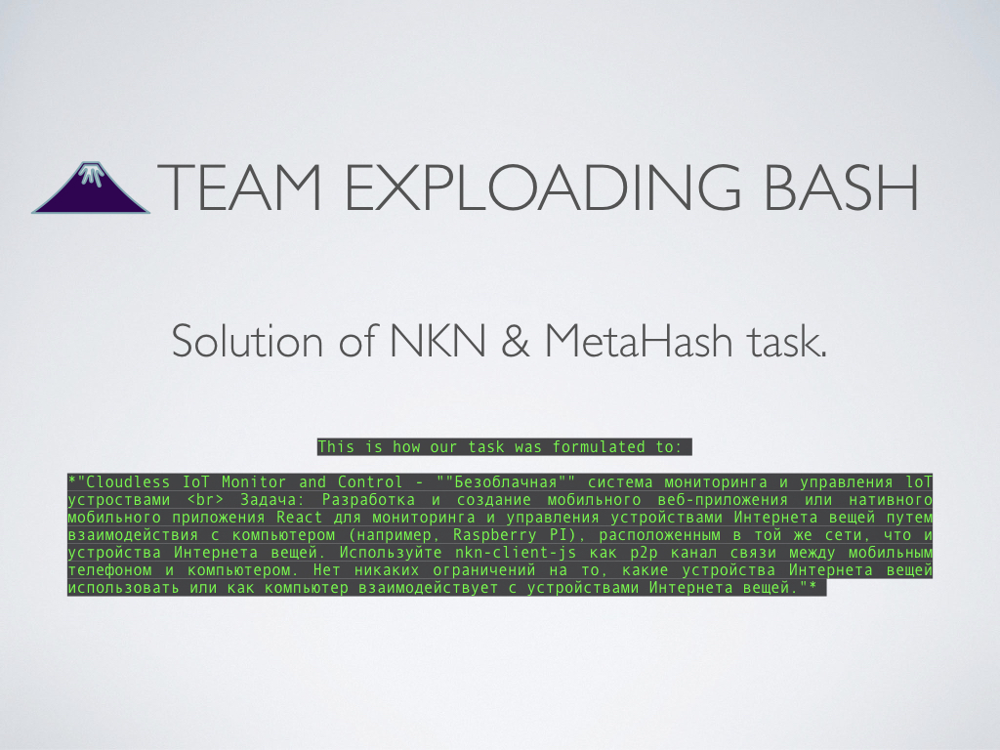
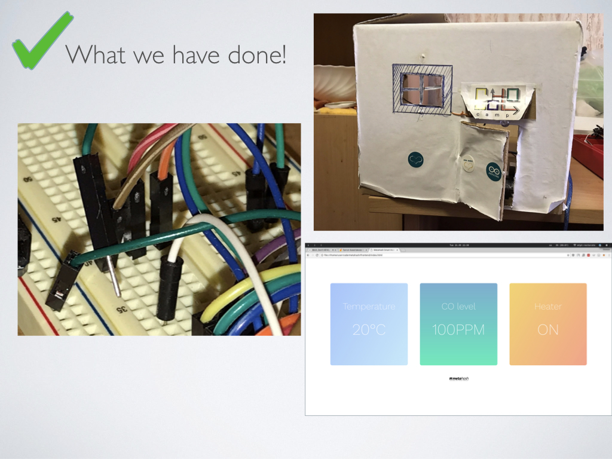
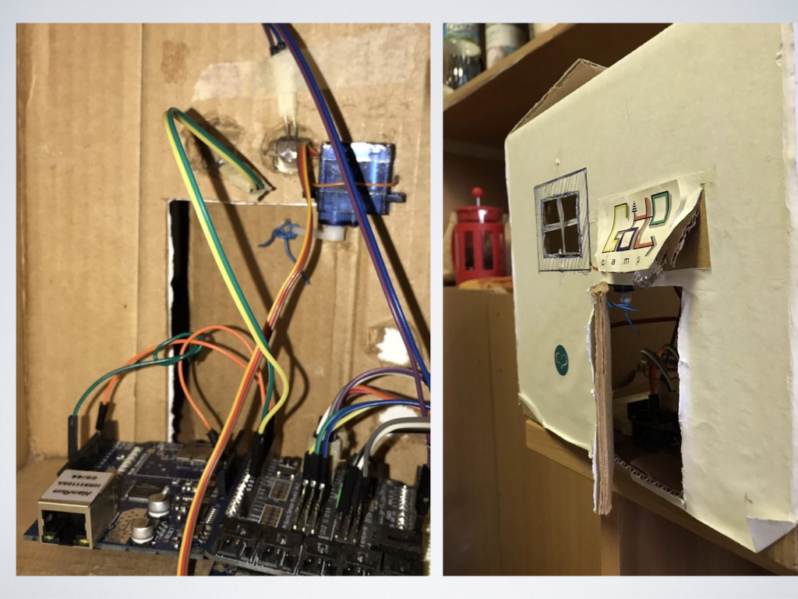
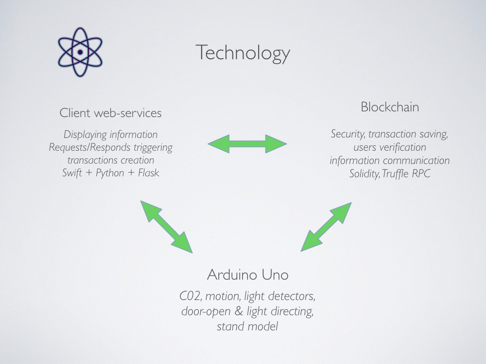
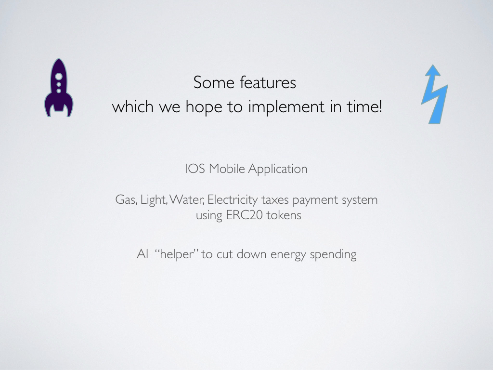
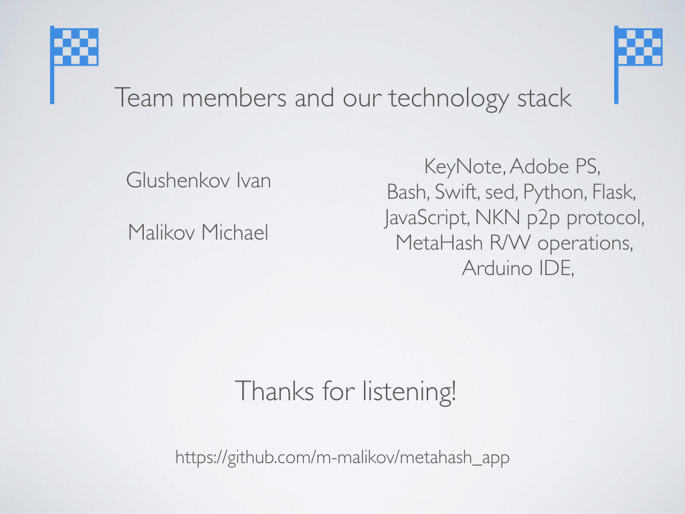

## Running the app

### 1. Build the app
```
docker build -t metahash_smarthome .
```

### 2. Run the app
```
docker run --network="host" metahash_smarthome
```

### 3. OPen the web interface on `http://localhost:5000`
